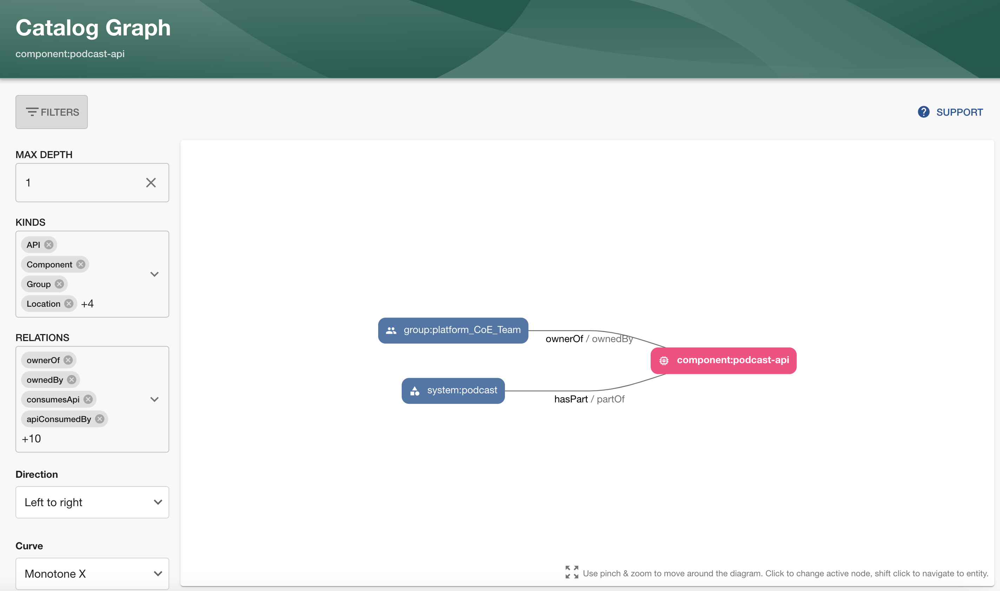
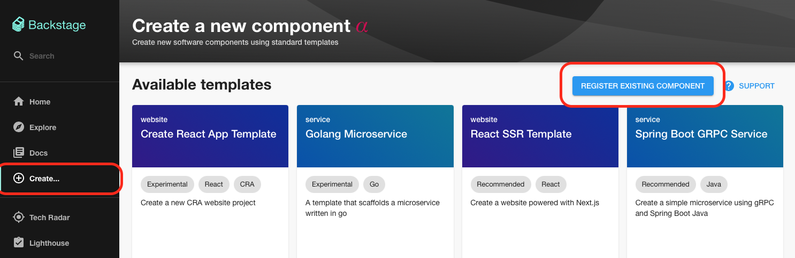
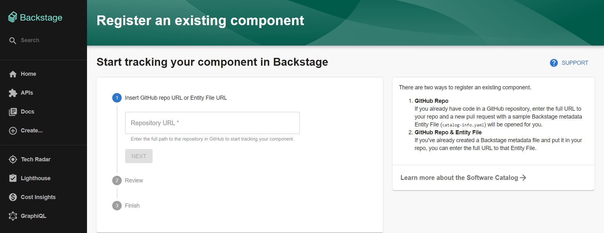

# Backstage의 catalog-info.yaml 작성 방법

## 1. Backstage Catalog란?
Backstage Catalog는 소프트웨어 구성 요소(Entity)를 등록하고 관리할 수 있는 Backstage의 핵심 기능입니다. 개발자는 이를 통해 조직 내의 소프트웨어 시스템을 구조화하고, 쉽게 검색 및 문서화할 수 있습니다. Catalog는 모든 소프트웨어 엔터티를 YAML 파일 형식의 'Entity Descriptor'를 사용하여 정의하고 등록합니다.

 * *참고: [(backstagel.io) Backstage Software Catalog](https://backstage.io/docs/features/software-catalog/)*

<br>

## 2. 사전 준비

- **Git 저장소**
  - 소프트웨어 엔터티(Entity)의 소스 코드가 저장된 Git 리포지토리가 필요합니다.

- **Catalog 등록을 위한 YAML 파일 작성**
  - Entity Descriptor 파일(.yaml)을 작성해야 합니다.
  - Backstage에서 제공하는 표준 형식을 따릅니다.

- **등록 권한**
  - Backstage 관리 권한 또는 Catalog 등록이 허용된 사용자 계정이 필요합니다.

<br>

## 3. Catalog YAML
### 1) Catalog 등록을 위한 YAML 파일
Catalog에 등록할 모든 엔터티는 YAML 파일로 정의됩니다. 기본적인 형식은 다음과 같습니다.

```yaml
apiVersion: backstage.io/v1alpha1
kind: Component
metadata:
  name: example-service
  description: This is an example service.
  tags:
    - backend
    - java
spec:
  type: service
  lifecycle: production
  owner: team-example
```

- **apiVersion**: 엔터티의 API 버전을 지정합니다. 예: backstage.io/v1alpha1
- **kind**: 엔터티의 종류를 지정합니다.
  - **Component**: 애플리케이션, 서비스, 라이브러리 등.
  - **Template**: 소프트웨어 템플릿.
  - **System**: 여러 구성 요소로 구성된 시스템.
  - **Domain**: 시스템을 묶는 큰 범위.
  - **Resource**: 데이터베이스나 스토리지 같은 리소스.
- **metadata**: 엔터티의 기본 정보(이름, 설명, 태그 등)를 포함합니다.
- **spec**: 엔터티의 세부 정보(타입, 수명 주기, 소유자 등)를 정의합니다.

<br>

### 2) Catalog 엔터티의 종류와 YAML 예제

#### Component (컴포넌트)
- 서비스, 애플리케이션, 라이브러리 등 개별 소프트웨어 구성 요소를 나타냅니다.
- 가장 많이 사용되는 엔터티 종류로, 다양한 소프트웨어 단위를 관리할 때 사용합니다.
```yaml
apiVersion: backstage.io/v1alpha1
kind: Component
metadata:
  name: payment-service
  description: 결제 서비스 백엔드
spec:
  type: service
  lifecycle: production
  owner: backend-team
```
- 주요 필드
  - spec.type: 컴포넌트의 유형 (예: service, website, library)
  - spec.lifecycle: 소프트웨어의 상태 (예: experimental, production)

<br>

#### Template (템플릿)
- 새로운 소프트웨어 프로젝트를 생성할 때 사용할 템플릿을 정의합니다.
- 개발자들이 표준화된 방식으로 소프트웨어를 시작할 수 있도록 지원합니다.
```yaml
apiVersion: backstage.io/v1alpha1
kind: Template
metadata:
  name: nodejs-template
  description: Node.js 기반의 서비스 생성 템플릿
spec:
  type: service
  owner: template-team
```

<br>

#### Location (위치)
- Entity Descriptor 파일이 위치한 경로를 정의합니다.
- Catalog에 엔터티를 등록할 때 엔터티 파일이 저장된 URL 또는 파일 경로를 나타냅니다.
```yaml
apiVersion: backstage.io/v1alpha1
kind: Location
metadata:
  name: catalog-repository
spec:
  type: url
  target: https://github.com/organization/repo/blob/main/catalog-info.yaml
```

<br>

#### System (시스템)
- 여러 개의 Component를 포함하는 소프트웨어 시스템을 나타냅니다.
- 대규모 애플리케이션 또는 플랫폼의 상위 단위를 관리할 때 사용합니다.
```yaml
apiVersion: backstage.io/v1alpha1
kind: System
metadata:
  name: order-management-system
  description: 주문 관리 시스템
spec:
  owner: operations-team
```

<br>

#### Domain (도메인)
- System을 묶는 큰 범위 또는 그룹을 나타냅니다.
- 주로 조직의 비즈니스 또는 기술 영역을 기반으로 정의됩니다.
```yaml
apiVersion: backstage.io/v1alpha1
kind: Domain
metadata:
  name: commerce-domain
  description: 전자상거래 관련 시스템 도메인
spec:
  owner: business-team
```

<br>

#### Resource (리소스)
- 데이터베이스, 파일 스토리지, 메시지 큐 등 시스템에 필요한 리소스를 정의합니다.
- 외부 의존성을 관리할 때 유용합니다.
```yaml
apiVersion: backstage.io/v1alpha1
kind: Resource
metadata:
  name: order-database
  description: 주문 데이터를 저장하는 데이터베이스
spec:
  type: database
  owner: database-team
```
- 주요필드
  - spec.type: 리소스의 유형 (예: database, queue)

<br>

#### API
```yaml
apiVersion: backstage.io/v1alpha1
kind: API
metadata:
  name: payment-api
  description: 결제 처리 API
spec:
  type: openapi
  lifecycle: production
  owner: api-team
```
- 주요 필드
  - spec.type: API 유형 (예: openapi, grpc).
  - spec.lifecycle: API의 상태.

<br>

#### User (사용자)
- Backstage 사용자 또는 개인을 나타냅니다.
- 주로 팀 또는 소프트웨어 소유자를 정의할 때 사용됩니다
```yaml
apiVersion: backstage.io/v1alpha1
kind: User
metadata:
  name: gd-hong
  description: Backend 개발자
spec:
  profile:
    email: gd.hong@kt.com
```
- 주요 필드
  - spec.profile.email: 사용자의 이메일.
  - metadata.name: 사용자 이름.

<br>

#### Group (그룹)
- 팀, 부서 등 사용자 그룹을 나타냅니다.
- 소프트웨어 소유자 또는 협업 그룹으로 설정 가능합니다.
```yaml
apiVersion: backstage.io/v1alpha1
kind: Group
metadata:
  name: backend-team
  description: 백엔드 개발팀
spec:
  type: team
  members:
    - gd-hong
    - gj-lim
```
- 주요 필드
  - spec.members: 그룹 멤버 목록.
  - spec.type: 그룹 유형 (예: team, department).

<br>

### 3) Entity간의 관계(relation) 작성
- Backstage Catalog에서 관계(Relation)는 엔터티 간의 연결성과 종속성을 나타냅니다. 
- 관계를 정의하면 소프트웨어 구성 요소 간의 의존성을 시각적으로 이해하고, 효과적으로 관리할 수 있습니다.



- 각 관계는 방향성을 가지며, 양방향으로 표현됩니다.
  - 예: A는 B를 ownedBy하고, B는 A를 ownerOf한다.
  - **spec** 필드를 통해 관계를 정의하면 Catalog 프로세서가 자동으로 관계를 생성합니다.

<br>

#### 관계(relation) 유형
##### 1) ownedBy와 ownerOf
  - 엔터티의 소유권 관계를 나타냅니다.
    - 소유자는 주로 조직 내의 그룹(Group) 또는 사용자(User)
    - 사용 예:
      - 서비스(Component)가 특정 팀(Group)에 소속된 경우.
      ```yaml
      apiVersion: backstage.io/v1alpha1
      kind: Component
      metadata:
        name: order-service
      spec:
        type: service
        owner: backend-team 
      ```
    - 자동으로 생성되는 기준 필드: **spec.owner**

##### 2) providesApi와 apiProvidedBy
  - 컴포넌트(Component)가 API를 제공하는 관계를 나타냅니다.
  - 사용 예:
    - 특정 서비스가 API를 제공하는 경우.
    ```yaml
    apiVersion: backstage.io/v1alpha1
    kind: Component
    metadata:
      name: user-service
    spec:
      type: service
      providesApis:
        - user-api
    ```
  - 자동으로 생성되는 기준 필드: **spec.providesApis**

##### 3) consumesApi와 apiConsumedBy
  - 컴포넌트(Component)가 API를 사용하는 관계를 나타냅니다.
  - 사용 예:
    - 프론트엔드 애플리케이션이 백엔드 API에 의존하는 경우.
  - 자동으로 생성되는 기준 필드: **spec.consumesApis**

##### 4) dependsOn와 dependencyOf
- 엔터티가 다른 엔터티에 의존하는 관계를 나타냅니다.
- 일반적인 의존성을 표현합니다.
- 사용 예:
    - 서비스가 데이터베이스를 사용하는 경우
    ```yaml
    apiVersion: backstage.io/v1alpha1
    kind: Component
    metadata:
      name: order-service
    spec:
      type: service
      owner: backend-team 
      dependsOn:
        - resource:default/order-database
    ```
    - 웹사이트가 외부 라이브러리를 사용하는 경우.
- 자동으로 생성되는 기준 필드: **spec.dependsOn**

##### 5) parentOf와 childOf
- 부모/자식 관계를 나타냅니다.
- 주로 그룹(Group) 간의 조직 구조를 정의할 때 사용됩니다.
- 자동으로 생성되는 기준 필드: **spec.parent** 또는 **spec.children**

##### 6) memberOf와 hasMember
- 사용자가 특정 그룹(Group)에 소속된 관계를 나타냅니다.
- 자동으로 생성되는 기준 필드: **spec.memberOf**
    ```yaml
    apiVersion: backstage.io/v1alpha1
    kind: User
    metadata:
      name: gd-hong-at-kt.com
    spec:
      profile:
      displayName: gd-hong
      memberOf: [Backend_Team]
    ```

#####  7) partOf와 hasPart
- 엔터티가 더 큰 도메인, 시스템, 컴포넌트에 속하는 관계를 나타냅니다.
- 사용 예:
  - 시스템이 도메인의 일부, 컴포넌트가 시스템의 일부인 경우.
  - 자동으로 생성되는 기준 필드: **spec.system** 또는 **spec.domain**

<br>

## 4. Catalog 등록
#### 1. app-config.yaml 에 등록
```yaml
# app-config.yaml
catalog:
  locations:
    - type: file
      target: ./templates/*.yaml
      rules:
        - allow: [Template]

    - type: url
      target: https://github.com/organization/repository/blob/main/catalog-info.yaml
      rules:
        - allow: [Component]
```
- app-config.yaml 파일에 위와 같이 catalog entity가 기록된 url 또는 경로를 입력합니다.
- Backstage를 재시작하면 설정된 모든 위치에서 YAML 파일을 스캔하여 자동으로 엔터티를 등록합니다.

<br>

#### 2. Backstage "Create" 메뉴를 통한 등록
- /create 메뉴에서 REGISTER EXISTING COMPONENT 버튼을 클릭하여 새 구성 요소를 등록할 수 있습니다.


- 해당 페이지에서 yaml 파일의 url를 입력합니다.

