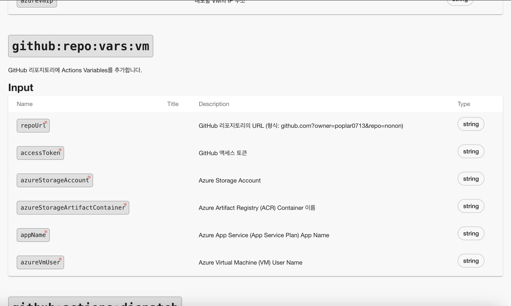

# Backstage Software Template의 "Custom action" 개발 방법

이 가이드는 Backstage Scaffolder에서 사용되는 Custom Action을 작성, 등록, 확장하는 방법을 설명합니다. 특히, GitHub 리포지토리에 Actions Variables를 추가하는 Custom Action 예제를 기반으로 전체 개발 프로세스를 다룹니다. 
<br>
참고: [(backstage.io) Writing Custom Actions 페이지](https://backstage.io/docs/features/software-templates/writing-custom-actions)

<br>

## 1. Custom Action의 개념
 Custom Action은 Backstage 템플릿 실행 시 특정 작업을 수행하기 위한 사용자 정의 동작입니다. 기본적으로 제공되는 Action(fetch:template, publish:github 등)을 확장하거나 조직의 요구에 맞는 작업을 자동화할 수 있습니다.
 
 <br>

## 2. Custom Action 개발 절차
### 2.1 createTemplateAction을 사용하여 Action 정의
아래는 GitHub 리포지토리에 Actions Variables를 추가하는 Custom Action의 코드 예제입니다.
```typescript
// package/backend/src/actions/github/vars-vm.ts
import { createTemplateAction } from '@backstage/plugin-scaffolder-node';
import { Octokit } from '@octokit/rest';

export function createVariablesVmTemplateAction() {
  return createTemplateAction<{
    repoUrl: string;
    accessToken: string;
    azureStorageAccount: string;
    azureStorageArtifactContainer: string;
    appName: string;
    azureVmUser: string;
  }>({
    id: 'github:repo:vars:vm',
    description: 'GitHub 리포지토리에 Actions Variables를 추가합니다.',
    schema: {
      input: {
        type: 'object',
        required: [
          'repoUrl',
          'accessToken',
          'azureStorageAccount',
          'azureStorageArtifactContainer',
          'appName',
          'azureVmUser',
        ],
        properties: {
          repoUrl: { type: 'string', description: 'GitHub 리포지토리의 URL (예: github.com?owner=poplar0713&repo=nonon)' },
          accessToken: { type: 'string', description: 'GitHub 액세스 토큰' },
          azureStorageAccount: { type: 'string', description: 'Azure Storage Account 이름' },
          azureStorageArtifactContainer: { type: 'string', description: 'Azure Artifact Registry (ACR) Container 이름' },
          appName: { type: 'string', description: 'Azure App Service (App Service Plan) App 이름' },
          azureVmUser: { type: 'string', description: 'Azure Virtual Machine (VM) 사용자 이름' },
        },
      },
    },
    async handler(ctx) {
      const {
        repoUrl,
        accessToken,
        azureStorageAccount,
        azureStorageArtifactContainer,
        appName,
        azureVmUser,
      } = ctx.input;

      // GitHub repoUrl 형식 검사
      const match = repoUrl.match(/^github\.com\?owner=(?<owner>[^&]+)&repo=(?<repo>[^&]+)$/);
      if (!match || !match.groups) {
        throw new Error(`유효하지 않은 GitHub 리포지토리 URL입니다: ${repoUrl}`);
      }
      const { owner, repo } = match.groups;

      ctx.logger.info(`리포지토리 github.com/${owner}/${repo}에 변수값을 추가합니다.`);

      const octokit = new Octokit({ auth: accessToken });

      const createRepositoryVariable = async (varName: string, varValue: string) => {
        await octokit.request('POST /repos/{owner}/{repo}/actions/variables', {
          owner: owner,
          repo: repo,
          name: varName,
          value: varValue,
          headers: { 'X-Github-Api-Version': '2022-11-28' },
        });
      };

      const tryCreateVariables = async (attempt: number = 1) => {
        try {
          await createRepositoryVariable('AZURE_STORAGE_ACCOUNT', azureStorageAccount);
          await createRepositoryVariable('AZURE_ARTIFACT_CONTAINER', azureStorageArtifactContainer);
          await createRepositoryVariable('APP_NAME', appName);
          await createRepositoryVariable('AZURE_VM_USER', azureVmUser);
        } catch (err) {
          if (attempt < 3) {
            ctx.logger.info(`리포지토리 생성 대기... (시도 ${attempt} 회)`);
            await new Promise(resolve => setTimeout(resolve, 3000)); // 3초 대기
            await tryCreateVariables(attempt + 1);
          } else {
            throw new Error(`변수 추가 실패, 리포지토리 ${(err as Error).message}`);
          }
        }
      };

      await tryCreateVariables();
    },
  });
}
```

#### - 주요 구성 요소 설명
- **createTemplateAction**: 
  - Backstage에서 Custom Action을 정의하는 API
  - id는 Action의 고유 식별자이며, 템플릿 YAML 파일에서 호출됩니다.
- **schema**: 
  - Action이 요구하는 입력값의 스키마를 정의합니다. 
  - required 필드와 properties를 사용해 입력값의 구조와 설명을 지정합니다.
- **handler**: 
  - Action의 실제 동작을 수행하는 함수입니다. 
  - 위 예제에서는 GitHub API 호출(Octokit)로 Variables를 추가하는 작업이 수행됩니다.

<br>

### 2.2 Action 등록하기
createBackendModule을 사용하여 작성한 Custom Action을 Backstage Backend에 등록합니다.

```typescript
// package/backend/src/actions/github/index.ts
import { createBackendModule } from '@backstage/backend-plugin-api';
import { scaffolderActionsExtensionPoint } from '@backstage/plugin-scaffolder-node/alpha';
import { createVariablesVmTemplateAction } from './vm-var-java-template';

export const createAddGithubRepositoryActionModule = createBackendModule({
  moduleId: 'github:register',
  pluginId: 'scaffolder:action',
  register({ registerInit }) {
    registerInit({
      deps: { scaffolderActions: scaffolderActionsExtensionPoint },
      async init({ scaffolderActions }) {
        scaffolderActions.addActions(createVariablesVmTemplateAction());
      },
    });
  },
});
```
#### - 주요 구성
- **createBackendModule**: 
  - Backstage에서 Backend 플러그인을 정의하는 함수입니다.
  - moduleId는 모듈 식별자, pluginId는 플러그인의 이름입니다.
- **scaffolderActions.addActions**: 
  - 작성한 Custom Action을 Scaffolder에 추가하는 함수입니다.


<br>

### 2.3. Backend에서 모듈 추가
index.ts 파일에서 위 모듈을 Backend에 등록합니다.
```typescript
// package/backend/src/index.ts
import { createAddGithubRepositoryActionModule } from './modules/github-secrets';

function startBackend() {
  const backend = createBackend();
  // ...
  backend.add(createAddGithubRepositoryActionModule); // 모듈 추가
}
```

<br>


## 3. Template에서 Custom Action 등록 확인 및 활용
- **(backstage url)/create/actions** 에서 등록된 action을 확인할 수 있습니다



- Custom Action은 템플릿 YAML 파일에서 다음과 같이 호출할 수 있습니다
```yaml
steps:
  - id: add-github-vars
    name: GitHub Variables 추가
    action: github:repo:vars:vm
    input:
      repoUrl: github.com?owner=poplar0713&repo=nonon
      accessToken: ${{ secrets.github_token }}
      azureStorageAccount: ${{ parameters.azureStorageAccount }}
      azureStorageArtifactContainer: ${{ parameters.azureStorageArtifactContainer }}
      appName: ${{ parameters.appName }}
      azureVmUser: ${{ parameters.azureVmUser }}
```