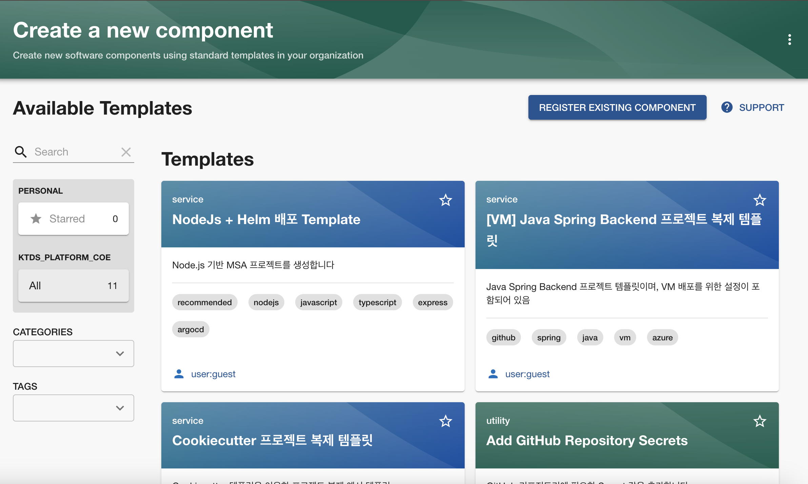
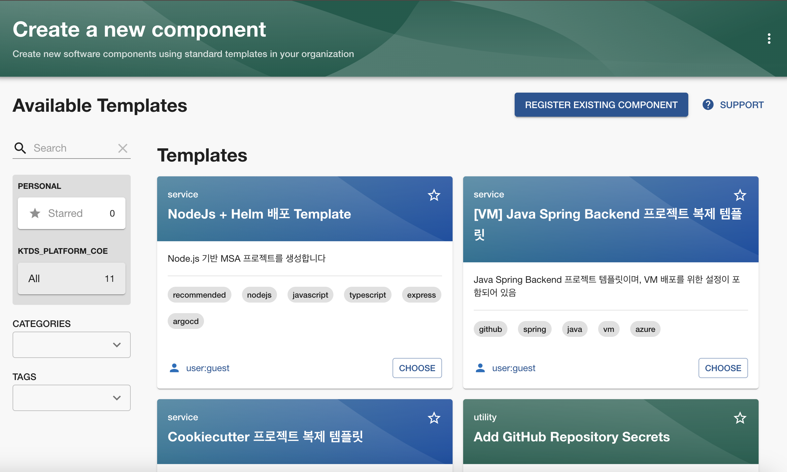

# Backstage의 "Custom Permission" 설정 방법
이 가이드는 Backstage에서 Custom Permission을 설정하는 방법을 설명합니다. 특히, Azure RBAC(Role-Based Access Control) 기반으로 접근 권한을 제어하는 예제를 중심으로 Permission Policy 구현, 등록, 및 확장을 다룹니다. <br>
참고: [(backstage.io) Defining custom permission rules 페이지](https://backstage.io/docs/permissions/custom-rules)

<br>

## 1. Custom Permission 개념
Custom Permission은 Backstage의 기본 권한 모델을 확장하여, 특정 요구사항(예: 클라우드 RBAC 역할, 조직별 규칙)을 기반으로 세부적인 접근 제어를 구현합니다. 이를 통해 다음과 같은 기능을 제공합니다:

- 사용자 또는 그룹 기반의 권한 정의
- 외부 API 호출을 통한 동적 권한 확인
- 특정 작업(예: 엔티티 삭제, 소프트웨어 템플릿 생성 등)에 대한 세부 제어

<br>

## 2. Azure RBAC 기반 Custom Permission 예제
### 2.1 Azure RBAC 기반 Permission 구현
아래 코드는 Azure RBAC 역할을 기반으로 사용자 권한을 확인하는 Custom Permission Policy입니다. 역할 확인은 Azure의 Graph API 및 Management API를 사용하며, RBAC 역할 중 'Owner' 권한을 가진 사용자에게만 작업을 허용합니다.

#### - 사전 조건
  * [Azure 기반 Auth 설정 완료](https://backstage.io/docs/auth/microsoft/provider)
  * 앱 등록 > 앱 > 관리 > API 사용 권한 추가 필요
    * Microsoft Graph API > User.Read.All 권한
    * Azure Management API > user_impersonation 권한

#### 목표 기능
  - 액세스 토큰 발급: Azure API 호출을 위한 인증 토큰 발급.
  - 사용자 Object ID 조회: 사용자 이메일을 통해 Azure Object ID를 가져옴.
  - RBAC 역할 확인: Azure 구독 ID를 기준으로 사용자의 역할 할당 목록을 확인.
  - 권한 검증: 'Owner' 역할이 있는 경우 template의 create 작업 허용.


#### - Azure RBAC 확인 로직 예제
```typescript
import { Config } from '@backstage/config';
import { AuthorizeResult } from '@backstage/plugin-permission-common';
import { PolicyQueryUser } from '@backstage/plugin-permission-node';

import axios from 'axios';

interface Credential {
  tenantId: string;
  clientId: string;
  clientSecret: string;
  subscriptionId: string;
}

// 액세스 토큰을 가져오는 함수
async function getAccessToken(credential: Credential, mode: string): Promise<string> {
  let scope = '';
  if(mode === 'graph') {
    scope = 'https://graph.microsoft.com/.default';
  } else if (mode === 'management') {
    scope = 'https://management.azure.com/.default';
  }

  const response = await axios.post(
    `https://login.microsoftonline.com/${credential.tenantId}/oauth2/v2.0/token`,
    new URLSearchParams({
      grant_type: 'client_credentials',
      client_id: credential.clientId,
      client_secret: credential.clientSecret,
      scope: scope
    })
  ).catch((error) => {
    console.error(`Failed to get ${scope} access token: ${error.message}`);
    throw error;
  });
  return response.data.access_token;
}

// 사용자 Object ID를 이메일로 가져오는 함수
async function getUserObjectIdByEmail(email: string, accessToken: string): Promise<string> {
  const response = await axios.get(
    `https://graph.microsoft.com/v1.0/users?$filter=mail eq '${email}'`,
    { headers: { Authorization: `Bearer ${accessToken}` } }
  ).catch((error) => {
    console.error(`Failed to get user object ID by email: ${error.message}`);
    throw error;
  });
  return response.data.value[0].id;
}

// ObjectId로 사용자에게 할당된 역할(RBAC) 배열을 리턴하는 함수
async function getUserRoleAssignments(userObjectId: string, subscriptionId: string, accessToken: string) {
  const response = await axios.get(
    `https://management.azure.com/subscriptions/${subscriptionId}/providers/Microsoft.Authorization/roleAssignments?api-version=2022-04-01&$filter=principalId eq '${userObjectId}'`,
    { headers: { Authorization: `Bearer ${accessToken}` } }
  ).catch((error) => {
    console.error(`Failed to get role assignments for user ID: ${error.message}`);
    throw error;
  });
  return response.data.value;
}

// 구독 ID로 Azure RBAC의 역할 명과 역할 ID 값 배열 리턴
async function getRBACListBySubscriptionId(subscriptionId: string, accessToken: string) {
  try {
    const response = await axios.get(
      `https://management.azure.com/subscriptions/${subscriptionId}/providers/Microsoft.Authorization/roleDefinitions?api-version=2022-04-01`,
      {
        headers: {
          'Authorization': `Bearer ${accessToken}`,
          'Content-Type': 'application/json'
        }
      }
    ).catch((error) => {
      console.error(`Failed to get role definitions for subscription ID: ${error.message}`);
      throw error;
    });

    // 그중 'Owner'에 해당하는 값 찾기//
    const filteredRoles = response.data.value.filter((role: { properties: { roleName: string } }) =>
      role.properties.roleName === 'Owner'
    ).map((role: { properties: { roleName: string }, id: string }) => ({
      roleName: role.properties.roleName,
      id: role.id
    }));

    return filteredRoles;

  } catch (error) {
    console.error('Error fetching role definitions:', error);
    return []; // Return an empty array in case of error//+
  }
}

export async function checkRBACPermissionPolicy(config: Config, user: PolicyQueryUser, ) {
  const userEntityRef = user.info.userEntityRef;
  const encodedEmail = userEntityRef.replace(/^user:default\//, '');
  const email = encodedEmail.replace('-at-', '@');
  if (!email.includes('@')) {
    console.warn('Decoded email format is invalid:', email);
    return { result: AuthorizeResult.DENY }; // Deny if decoding fails
  }

  // app-config.yaml에서 선언된 backstage app의 인증 정보를 가져옴
  const clientId = config.getString('auth.providers.microsoft.development.clientId');
  const clientSecret = config.getString('auth.providers.microsoft.development.clientSecret');
  const tenantId = config.getString('auth.providers.microsoft.development.tenantId');
  const subscriptionId = config.getString('auth.providers.microsoft.development.subscriptionId');

  const credential: Credential = { tenantId, clientId, clientSecret, subscriptionId };

  // grap api의 접근 가능 토큰 획득
  const graphAccessToken = await getAccessToken(credential, 'graph');

  // management api의 접근가능 토큰 획득
  const managementAccessToken = await getAccessToken(credential, 'management');
  // user의 email을 바탕으로 User의 object id 조회
  const userObjectId = await getUserObjectIdByEmail(email, graphAccessToken);
  
  // user의 RBAC 역할 목록 찾아오기
  const roleAssignmentsArray = await getUserRoleAssignments(userObjectId, subscriptionId, managementAccessToken);

  // 현재 구독의 RBAC역할들의 ID 값 가져오기
  const roleIDList = await getRBACListBySubscriptionId(subscriptionId, managementAccessToken);

  // user의 RBAC 목록중에 roleIDList에 해당되는 값 있는지 확인
  const hasPermission = await roleAssignmentsArray.some((assignment: any) => {
    return roleIDList.some(
      (role: any) =>
        role.id.toLowerCase() === assignment.properties.roleDefinitionId.toLowerCase()
    );
  });

  return hasPermission;
}
```

### 2.2 Custom Permission Policy 등록 
Backstage의 Custom Permission Policy는 PermissionPolicy 인터페이스를 구현하여 정의하고, Backend 모듈에 등록됩니다.

#### - 코드 예제: Custom Permission Policy
```typescript
import { PermissionPolicy, PolicyQuery, PolicyQueryUser } from '@backstage/plugin-permission-node';
import { AuthorizeResult } from '@backstage/plugin-permission-common';
import { checkRBACPermissionPolicy } from './azureUserRoles';

class CustomPermissionPolicy implements PermissionPolicy {
  private config: Config;

  constructor(config: Config) {
    this.config = config;
  }

  async handle(request: PolicyQuery, user?: PolicyQueryUser): Promise<PolicyDecision> {
    if (request.permission.name === 'scaffolder.task.create') {
      if (!user || !await checkRBACPermissionPolicy(this.config, user)) {
        return { result: AuthorizeResult.DENY };
      }
    }
    return { result: AuthorizeResult.ALLOW };
  }
}
```

<br>


## 3. 권한 적용 확인

1. **Azure RBAC 'Owner' 권한이 없는 사용자의 경우**


<br>

2. **Azure RBAC 'Owner' 권한을 가진 사용자의 경우**
