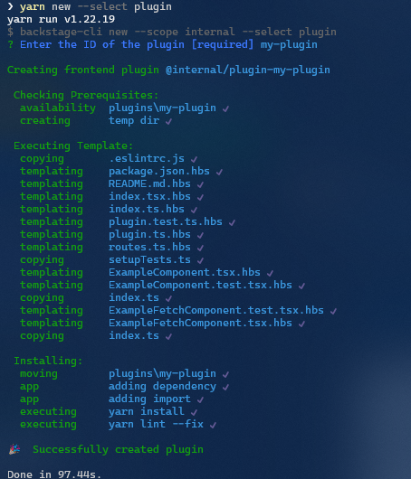

# Backstage Custom Plugin 개발 및 적용 가이드

- Backstage는 Plugin을 통해 다양한 기능을 확장할 수 있는 플랫폼입니다. 
- 이 문서는 Backstage의 Custom Plugin 생성, 개발, 구조 및 사용 방법을 설명합니다.
- Frontend와 Backend 각각 구성하는 방법을 가이드합니다.

*참고 : [Introduction to Plugins](https://backstage.io/docs/plugins/)*

<br>

## 1. Plugin 생성
### 1.1 플러그인 생성(app, frontend) 명령어
```bash
yarn new --select plugin
```


- **"Enter the ID of the plugin"** 에서 플러그인 이름 입력
- 이후 자동으로 plugin 폴더에 예시 플러그인이 생성됩니다.
```css
plugins/
  <plugin-name>/
    src/
      components/
        ExampleComponent/
          ...
      routes.ts
      plugin.ts
      index.ts
    package.json
```

- 플러그인 종속성 추가
  - app/package.json에 플러그인을 종속성으로 추가합니다.
- 앱에 플러그인 확장 연결
  - app/src/App.tsx에서 플러그인의 확장을 경로에 추가합니다.
```tsx
import { ExamplePage } from '@backstage/plugin-example';
<Route path="/example" element={<ExamplePage />} />
```

### 1.2 Backend 플러그인 생성 명령어
```bash
yarn new --select backend-plugin
```


- **"Enter the ID of the plugin"** 에서 플러그인 이름 입력
- 이후 자동으로 plugin 폴더에 backend 예시 플러그인이 생성됩니다.

```css
plugins/
  <plugin-name>-backend/
    src/
      service/
        router.ts
        router.test.ts
      plugin.ts
      index.ts
    package.json
```
- packages/backend/src/index.ts에서 플러그인이 추가됨
```typescript
backend.add(import('@internal/plugin-notice-board'));
```

<br>

## 2. 플러그인 기본 구조
### 2.1 플러그인 기본 구조
####  Frontend 플러그인 구조

<br>

**- src/components/**
  - React 컴포넌트를 작성하는 폴더로, 플러그인의 주요 UI 화면을 구성하기 위한 여러 tsx파일들이 위치

<br>

**- src/routes.ts**
  - 플러그인의 라우팅을 정의하는 파일입니다.
  - 플러그인이 Backstage 애플리케이션에 통합될 때의 경로와 대응하는 컴포넌트를 지정합니다.
```ts
import { createRouteRef } from '@backstage/core-plugin-api';

export const rootRouteRef = createRouteRef({
  id: 'notice-board', // 고유 라우트 ID
});
```

<br>

**- src/plugin.ts**
  - 플러그인의 ID와 라우팅 경로를 정의합니다.
  - 플러그인의 UI를 렌더링하기 위한 Routable Extension을 제공합니다.
```typescript
// 예시
import {
  createPlugin,
  createRoutableExtension,
} from '@backstage/core-plugin-api';
import { rootRouteRef } from './routes';

export const noticeBoardPlugin = createPlugin({
  id: 'notice-board',
  routes: {
    root: rootRouteRef, // 라우팅 기본 경로
  },
});

export const NoticeBoardPage = noticeBoardPlugin.provide(
  createRoutableExtension({
    name: 'NoticeBoardPage',
    component: () =>
      import('./components/').then(m => m.NoticeBoardPage), // 컴포넌트 비동기 로드
    mountPoint: rootRouteRef, // 경로와 연결
  }),
);
```

<br>

**- src/index.ts**
  - 플러그인의 기본 엔트리 포인트입니다.
  - plugin.ts에서 정의된 플러그인을 외부로 내보냅니다.
```typescript
// 예시
export { noticeBoardPlugin } from './plugin';
export { NoticeBoardListPage } from './components/NoticeBoardListPage';
```

#### Backend 플러그인 구조
**- src/service/**
  - 비즈니스 로직을 구현하는 폴더입니다.
  - 데이터베이스 접근, 데이터 처리, 기타 서비스 로직 등을 작성합니다.

<br>

**- src/service/routes.ts**
  - API 엔드포인트를 정의하는 파일입니다.
  - 클라이언트 요청을 처리하고, 비즈니스 로직 호출 후 데이터를 반환합니다.
```typescript
// 예시
export async function createRouter({ logger, config, database }: RouterOptions): Promise<express.Router> {
  // 라우터 초기화 부분
  const router = Router();
  router.use(express.json());
  router.use(express.urlencoded({ extended: true }));

  // api 구현
  router.get('/posts', async (req: Request, res: Response) => {
    // 로직 구현
  res.status(200);
  });

```

<br>

**- src/plugin.ts**
  - Backend 플러그인의 진입점으로, 라우터를 초기화합니다.
  - 플러그인이 Backstage Backend 애플리케이션에 통합될 때 호출됩니다.
  - 플러그인의 핵심 로직을 실행하는 진입점 역할을 합니다.
  - createBackendPlugin을 사용하여 플러그인을 정의합니다.
    - 종속성(deps)은 플러그인의 동작에 필요한 서비스를 정의합니다.
        - 예: httpRouter, logger, config, httpAuth, userInfo.
```typescript
import { coreServices, createBackendPlugin } from '@backstage/backend-plugin-api';

export const noticeBoardPlugin = createBackendPlugin({
  pluginId: 'notice-board',
  register(env) {
    env.registerInit({
      deps: {
        httpRouter: coreServices.httpRouter,
        logger: coreServices.logger,
        config: coreServices.rootConfig,
        httpAuth: coreServices.httpAuth,
        userInfo: coreServices.userInfo,
      },
      async init({ httpRouter, logger, config, httpAuth, userInfo }) {
        // 초기화 로직
      },
    });
  },
});
```
- 플러그인에 필요한 경로를 Express 라우터를 통해 정의하고, HTTP 라우터에 추가합니다.
```ts
import { createRouter } from './service/router';

const router = await createRouter({
  logger,
  config,
  database,
  httpAuth,
  userInfo,
});

httpRouter.use(router);

// 인증 정책 추가
httpRouter.addAuthPolicy({
  path: '/posts',
  allow: 'unauthenticated', // 인증 없이 접근 가능
});
```

<br>

**- src/index.ts**
  - 플러그인의 기본 엔트리 포인트입니다.
  - 플러그인의 라우터 및 기타 핵심 구성 요소를 외부로 내보냅니다.
```typescript
// 예시
export { createRouter } from './routes';
export { Database } from './service/database';
```

<br>

## 3. Backstage Backend Proxy 설정 및 Backend Plugin API 사용 가이드

### 3.1 Backend Proxy 설정
- app-config.yaml 파일에서 프록시를 설정하면, 프론트엔드에서 요청을 백엔드로 리다이렉트할 수 있습니다. 이는 외부 API, 백엔드 플러그인, 혹은 마이크로서비스와의 상호작용을 단순화합니다.

```yaml
proxy:
  '/notice-board':
    target: "http://localhost:7007/api/notice-board"
```
- /notice-board: 프록시 경로. 프론트엔드가 이 경로를 호출합니다.
- target: 백엔드 플러그인의 API 엔드포인트. 여기서는 notice-board 플러그인의 백엔드 URL을 설정합니다.


### 3.2 프론트엔드 API 클라이언트 구현 예시
#### 3.2.1 API 메서드 인터페이스 정의
- interface를 통해 백엔드 플러그인 API의 메서드를 정의합니다.
```ts
// src/api/NoticeBoardApiClient.ts
export interface NoticeBoardApi {
  getPosts(page?: number, size?: number, search?: string): Promise<any>;
  getPost(id: string): Promise<any>;
  createPost(data: FormData): Promise<any>;
  updatePost(id: string, data: FormData, deleteImages?: string[], deleteFiles?: string[]): Promise<any>;
  deletePost(id: string): Promise<any>;
}
```

#### 3.2.2 NoticeBoardApi를 구현
- Backstage의 DiscoveryApi를 활용해 동적으로 백엔드 URL을 생성합니다.
  - **DiscoveryApi**는 Backstage의 프론트엔드에서 백엔드 플러그인이나 외부 서비스의 URL을 동적으로 가져오기 위해 사용하는 API입니다. 환경별로 다를 수 있는 백엔드 URL을 중앙에서 관리하며, 프론트엔드 코드에서 이를 동적으로 조회할 수 있도록 지원합니다.
```ts
// src/api/NoticeBoardApiClient.ts
import { DiscoveryApi } from '@backstage/core-plugin-api';

export class NoticeBoardApiClient implements NoticeBoardApi {
  private readonly discoveryApi: DiscoveryApi;

  constructor(discoveryApi: DiscoveryApi) {
    this.discoveryApi = discoveryApi;
  }

  private async getBaseUrl(): Promise<string> {
    return `${await this.discoveryApi.getBaseUrl('notice-board')}`;
  }

  async getPosts(page: number = 1, size: number = 10, search: string = ''): Promise<any> {
    const baseUrl = await this.getBaseUrl();
    const query = new URLSearchParams({ page: `${page}`, size: `${size}`, search }).toString();
    const response = await fetch(`${baseUrl}/posts?${query}`);
    return await response.json();
  }

  // 기타 CRUD 메서드 구현 (앞서 설명한 `createPost`, `updatePost`, `deletePost` 참고)
}
```

#### 3.2.3 API 팩토리 정의
- API 참조와 클라이언트를 연결하여 플러그인에 등록합니다.
```ts
// src/api/index.ts
import { discoveryApiRef, createApiFactory } from '@backstage/core-plugin-api';
import { noticeBoardApiRef, NoticeBoardApiClient } from './NoticeBoardApiClient';

export const noticeBoardApiFactory = createApiFactory({
  api: noticeBoardApiRef,
  deps: { discoveryApi: discoveryApiRef },
  factory: ({ discoveryApi }) =>
    new NoticeBoardApiClient(discoveryApi),
});
```

#### 3.2.4 프론트엔드 컴포넌트에서 API 호출
- useApi 훅을 통해 API를 호출하고 데이터를 렌더링합니다.
```ts
export const NoticeBoardDetailPage = () => {
  const api = useApi(noticeBoardApiRef);
  const { id } = useParams();
  const navigate = useNavigate();
  const [post, setPost] = useState<any>(null);

  useEffect(() => {
    const fetchPost = async () => {
      const data = await api.getPost(id!);
      setPost(data);
    };
    fetchPost();
  }, [id, api]);
```