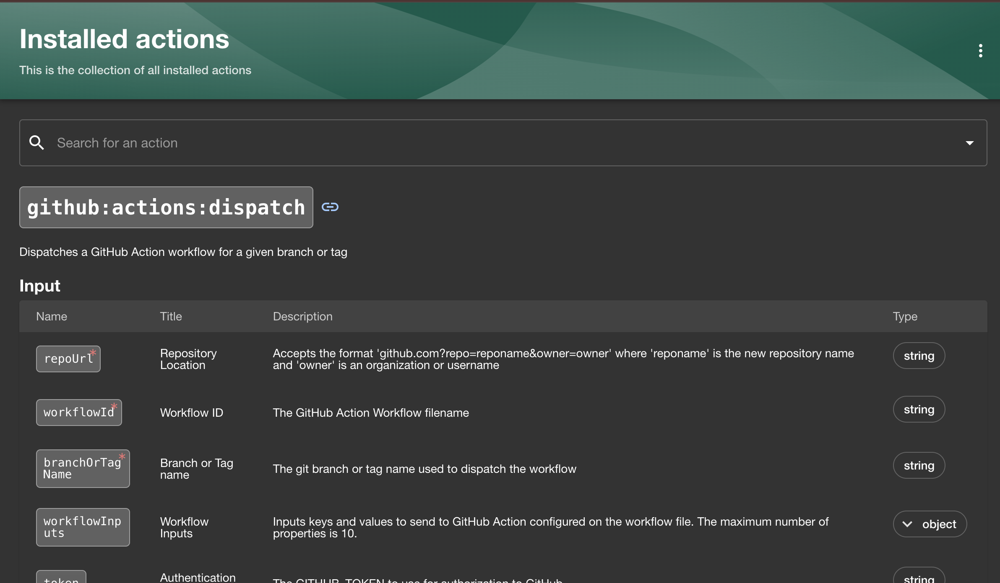

# Backstage Software Template 작성 방법

#### [Backstage Software Templates 공식 가이드 문서](https://backstage.io/docs/features/software-templates/)

*이 문서는 Backstage에서 VM 배포 및 GitHub 연동을 포함한 Java Spring Backend 프로젝트 템플릿을 작성하는 방법을 설명합니다. 템플릿 작성에 필요한 구성 요소와 작성된 YAML 파일의 세부 내용을 단계별로 설명합니다.*

<br>

## 1. Template의 구성요소
Backstage에서 템플릿은 Template 엔티티로 작성되며, 프로젝트 생성 프로세스를 자동화하고 사용자 입력을 기반으로 작업을 수행합니다. 템플릿 작성은 다음 세 가지 주요 단계로 이루어집니다:

1. Metadata 작성: 템플릿의 이름, 설명, 태그 등을 정의합니다.
2. Parameters 정의: 사용자 입력을 받아 템플릿을 커스터마이징할 수 있는 파라미터를 설정합니다.
3. Steps 정의: 템플릿 실행 시 수행할 작업 단계(예: GitHub 연동, 파일 복사, 인증 키 등록 등)를 작성합니다.

<br>

## 2. 템플릿 Yaml 구조
### 2.1. Metadata 작성

```yaml
# 예시
apiVersion: scaffolder.backstage.io/v1beta3
kind: Template
metadata:
  name: github-vm-backend-example
  title: '[VM] Java Spring Backend 프로젝트 복제 템플릿'
  description: 'Java Spring Backend 프로젝트 템플릿이며, VM 배포를 위한 설정이 포함되어 있음'
  tags:
    - github
    - spring
    - java
    - vm
    - azure
```

- **apiVersion**: 템플릿에서 사용되는 Backstage API 버전을 명시합니다.
- **kind**: 템플릿의 종류로 항상 Template을 사용합니다.
- **metadata**: 템플릿의 이름, 제목, 설명, 태그를 정의합니다.

<br>

### 2.2 Parameters 정의
사용자 입력을 받기 위한 파라미터를 설정합니다. 각 섹션은 관련된 정보를 입력받도록 나뉩니다.

* 파라미터 정보 입력
사용자가 필요한 파라미터 정보를 입력할 수 있도록 설정합니다.

```yaml
# 예시
parameters:
  - title: 새로운 프로젝트의 정보를 입력해주세요
    required:
      - owner
      - packageName
      - projectName
      - about
    properties:
      owner:
        title: 소유자
        type: string
        description: 프로젝트의 소유 그룹을 지정해 주세요
        default: group:default/platform_coe_team # default = 기본 입력 값
        ui:field: OwnerPicker
        ui:options:
          allowedKinds:
          - Group
      packageName:
        title: 패키지 명
        type: string
        default: com.ktds 
      projectName:
        title: 프로젝트 명
        type: string
        description: 프로젝트의 이름을 입력해주세요. (고유)
        ui:autofocus: true
        default: VmSpringProject
      about:
        title: 프로젝트 설명
        type: string
        description: 프로젝트에 대한 설명을 입력해주세요.
        default: VmSpringProject

  - title: Azure 자격증명 정보 입력
    required:
      - azureCredentials
    properties:
      azureCredentials:
        title: Azure 자격증명 입력
        type: string
        ui:widget: textarea
        ui:options:
          rows: 15
        default: |
          {
            "clientId": "client-id",
            "clientSecret": "client-secret",
            "subscriptionId": "subscription-id",
            "tenantId": "tenant-id"
          }
```

 - **required** : 필수 입력 필드를 지정합니다.
 - **properties** : 각 파라미터의 세부 정보를 설정합니다.
 - **ui** : 템플릿의 사용자 인터페이스를 정교하게 설계하는 데 사용하며, 주요 속성은 아래와 같다
    - ui:field: 입력 필드의 타입 설정.
    - ui:widget: 텍스트, 체크박스, 드롭다운 등 위젯 종류 지정.
    - ui:options: 위젯 옵션 설정 (예: placeholder, rows).
    - ui:help: 사용자에게 추가 설명 제공. 
    - ui:placeholder: 입력 필드에 힌트를 제공.

<br>

### 2.3 Steps 정의

템플릿이 생성될 때 실행할 작업은 spec.steps에 정의됩니다. 각 단계는 사용자가 템플릿을 생성하는 데 필요한 작업을 정의합니다. 여기에는 파일을 복사하거나 스크립트를 실행하는 등의 작업이 포함될 수 있습니다.

* steps 작성 예시
```yaml
  steps:
    # 템플릿을 사용하여 프로젝트 생성
    - id: fetch-template
      name: 템플릿 복제
      action: fetch:template # 실행할 작업
      input:
        cookiecutterCompat: true # Cookiecutter 사용
        url: 'https://github.com/sunghwan-joo/Java_Template/tree/main/skeleton/' # 원본 소스 주소
        values:
          package_name: ${{ parameters.packageName }}
          project_name: ${{ parameters.projectName }}
          owner: ${{ parameters.owner }}
          description: ${{ parameters.about }}
          github_repo_name: ${{ parameters.githubRepoName }}
          github_repo_owner: ${{ parameters.githubRepoOwner }}
        copyWithoutTemplating: # 변경 없이 복제할 경로
          - .github/workflows/
          - manifests/
```

- **각 단계의 주요 필드**

1. id: 단계의 고유 식별자. 다른 단계에서 참조하거나 로그에서 식별하는 데 사용됩니다.
2. name: 단계 이름. 사용자 인터페이스에서 작업을 설명할 때 사용됩니다.
3. action: 실행할 작업의 유형(액션). Backstage에서 제공하는 기본 액션이나 커스텀 액션을 지정합니다.
4. input: 단계 및 action 실행에 필요한 입력값을 정의. parameters에서 받은 입력값 사용 가능
5. output: 해당 단계의 실행 결과로 출력되는 값(선택 사항).

#### *- 사용중인 Backstage에 등록된 action을 확인할 수 있는 링크: **<backstage url>/create/actions***
- 기본으로 설치된 action들 및 custom action들 모두 해당 URL에서 확인이 가능하다 <br>
 

**참고 : [커스텀 Template Acton 작성 가이드](../pages/custom-action-guide.md)**


### 2.4 output 정의 

- 템플릿 실행이 완료된 후 사용자에게 프로젝트의 카탈로그, Github 링크 등을 제공할 수 있음
- 결과물에 대한 빠른 접근 및 즉시 확인 가능

```yaml
output:
  links:
    - title: Repository # 
      url: ${{ steps['publish'].output.remoteUrl }}
    - title: 카탈로그 열기
      icon: catalog
      entityRef: ${{ steps['register'].output.entityRef }}
```

* 주요 파라미터
  - title: 링크의 제목. 사용자 인터페이스(UI)에 표시됩니다.
  - url: 링크의 URL. 템플릿 실행 후 생성된 결과물(예: GitHub 저장소 주소)링크 제공
  - icon: 링크에 사용할 아이콘. Backstage에서 제공하는 아이콘(예: catalog)을 지정
  - entityRef: Backstage 카탈로그에서 엔티티를 참조하기 위한 고유 식별자.

<br>


## 3. 등록된 Template 및 결과 확인

- 등록된 템플릿은 아래와 같이 표시됩니다


<br>

- 작성된 템플릿의 파라미터 입력 단계는 다음과 같이 표시됩니다


<br>

- 설정한 step에 따라 작업이 진행되게 됩니다
